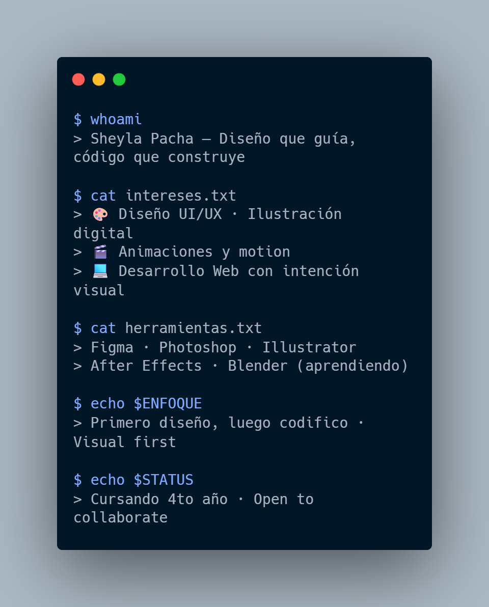

### 👾 Sheyla Pacha
#### Ingeniería de Software · 4to año
#### Status: Aprendiendo · Construyendo 🚀

---

─────────────── ⚡ SOBRE MÍ ───────────────

 

  

 

---

─────────────── 🛠️ TECNOLOGÍAS ───────────────

**Lenguajes**

**Herramientas creativas y de desarrollo**

---

─────────────── 📈 HABILIDADES ───────────────

---

─────────────── 📊 ESTADÍSTICAS ───────────────

  
  

  

---

─────────────── 🕹️ LÍNEA DE TIEMPO ───────────────

| Año | Hito |
|-----|------|
| 2025 | Cursando 4to año · Explorando UI/UX y motion design |
| 2024 | Sistema de registro estudiantil (Java + MySQL) |
| 2023 | Calculadora científica (Python + Tkinter) |
| 2022 | Inicio en programación · Python · Java |

---

─────────────── 🛰️ PROYECTOS ───────────────

| Proyecto | Descripción | Stack |
|----------|-------------|-------|
| 🧮 [Calculadora científica](https://github.com/Zzzheyla/calculadora-cientifica) | Calculadora con operaciones avanzadas y UI interactiva | Python · Tkinter |
| 📋 [Sistema de registro](https://github.com/Zzzheyla/sistema-registro) | App para gestión y registro de estudiantes | Java · MySQL |
| 🌐 [Portfolio web](https://github.com/Zzzheyla/portfolio) | Sitio personal con proyectos y perfil profesional | HTML · CSS · JavaScript |

---

─────────────── 💼 DISPONIBLE PARA ───────────────

- 🎨 Prácticas en Diseño UI/UX o Frontend creativo
- 🎬 Proyectos con motion design o ilustración digital
- 💻 Desarrollo Web con enfoque visual
- 🤝 Colaboración en proyectos open source

---

**> Sistema online · Sheyla Pacha · 2026**

